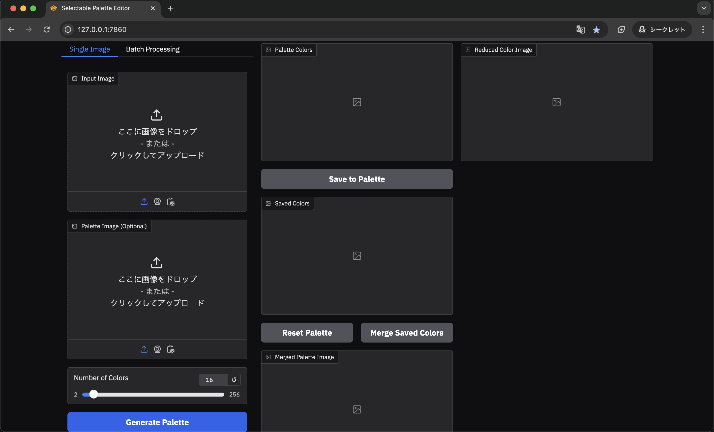
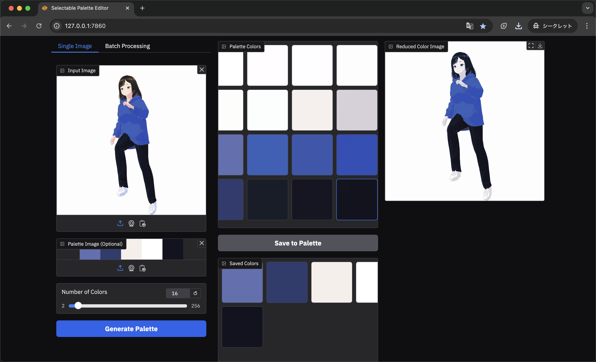

# Selectable Palette Editor

日本語版は[コチラ](https://github.com/zomian87x/selectable-palette-editor/tree/main?tab=readme-ov-file#%E3%82%BB%E3%83%AC%E3%82%AF%E3%82%BF%E3%83%96%E3%83%AB%E3%83%91%E3%83%AC%E3%83%83%E3%83%88%E3%82%A8%E3%83%87%E3%82%A3%E3%82%BF)

A web-based tool for image color quantization, palette extraction, and batch image processing. The application allows users to generate palettes, save custom colors, and apply them to images, making it ideal for artists, designers, and developers working with reduced color palettes.

## Features

### Tab 1: Image Color Quantizer
- Extract a palette of dominant colors from an image.
- Generate reduced-color versions of images using extracted palettes.
- Save custom colors to a palette.
- Batch process multiple images using a single palette.

### Tab 2: Color Map Generator
- Create a full 2D color map with adjustable brightness.
- Generate combined color maps with customizable regions and mid-tone highlights.

---

## Installation

1. Clone this repository:
   ```bash
   git clone https://github.com/your-username/selectable-palette-editor.git
   cd selectable-palette-editor
   ```

2. Install the required dependencies:
   ```bash
   pip install -r requirements.txt
   ```

3. Run the application:
   ```bash
   python your_script_name.py
   ```

---

## Usage

### Tab 1: Image Color Quantizer

#### Single Image Mode
1. Upload an image in the **"Input Image"** field.
2. (Optional) Upload a palette image in **"Palette Image"** field.
3. Select the number of colors to extract using the slider.
4. Click **"Generate Palette"** to view the palette and the reduced-color version of the image.

#### Batch Processing Mode
1. Specify an input folder containing images to process.
2. Specify an output folder to save the processed images.
3. (Optional) Upload a palette image to use for all images in the batch.
4. Select the number of colors to extract using the slider.
5. Click **"Process Batch"** to process all images in the folder.


---

### Tab 2: Color Map Generator
1. Generate a full 2D color map or combined color map using the built-in tools.
2. Customize specific regions of the color map by specifying ranges (x_min, x_max, y_min, y_max).
3. Save or use the modified color map in other applications.

---

## Output Directories

The application creates and uses the following directories:
- `./colors`: Stores saved individual color images.
- `./palette`: Stores the merged palette image.

---

## Dependencies

- `gradio`: For the interactive web interface.
- `Pillow`: For image processing.
- `numpy`: For numerical operations.
- `matplotlib`: For visualizing color maps.

Install all dependencies with:
```bash
pip install -r requirements.txt
```

---

## License

This project is licensed under the [MIT License](LICENSE).

---

## Contributing

1. Fork the repository.
2. Create a new branch (`git checkout -b feature-branch`).
3. Commit your changes (`git commit -m 'Add a new feature'`).
4. Push to the branch (`git push origin feature-branch`).
5. Open a pull request.

---

## Screenshots

### Tab 1: Image Color Quantizer


### Tab 2: Color Map Generator


---

## Acknowledgements

This project was inspired by tools for color palette management and aims to streamline the process of reducing image colors for creative applications.

---


# セレクタブルパレットエディタ

画像の色量子化、パレット抽出、およびバッチ画像処理のためのウェブベースのツールです。このアプリケーションでは、パレットを生成し、カスタムカラーを保存し、それらを画像に適用することができます。アーティスト、デザイナー、開発者が限られたカラーパレットで作業するのに理想的です。

## 機能

### タブ 1: 画像カラークオンタイザ
- 画像から主要な色のパレットを抽出。
- 抽出されたパレットを使用して、色を減らした画像を生成。
- カスタムカラーをパレットに保存。
- 単一のパレットを使用して複数の画像を一括処理。

### タブ 2: カラーマップジェネレータ
- 明度を調整可能な2次元のカラーマップを生成。
- カスタマイズ可能な領域と中間トーンハイライトを持つ結合カラーマップを生成。

---

## インストール

1. このリポジトリをクローン:
   ```bash
   git clone https://github.com/your-username/selectable-palette-editor.git
   cd selectable-palette-editor
   ```

2. 必要な依存関係をインストール:
   ```bash
   pip install -r requirements.txt
   ```

3. アプリケーションを実行:
   ```bash
   python your_script_name.py
   ```

---

## 使用方法

### タブ 1: 画像カラークオンタイザ

#### 単一画像モード
1. **"Input Image"** フィールドに画像をアップロード。
2. （オプション）**"Palette Image"** フィールドにパレット画像をアップロード。
3. スライダーを使って抽出する色の数を選択。
4. **"Generate Palette"** をクリックして、パレットと減色された画像を表示。

#### バッチ処理モード
1. 処理する画像が含まれる入力フォルダを指定。
2. 処理後の画像を保存する出力フォルダを指定。
3. （オプション）すべての画像に使用するパレット画像をアップロード。
4. スライダーを使って抽出する色の数を選択。
5. **"Process Batch"** をクリックしてフォルダ内のすべての画像を処理。

---

### タブ 2: カラーマップジェネレータ
1. 組み込みツールを使用して、フル2次元カラーマップまたは結合カラーマップを生成。
2. 範囲 (x_min, x_max, y_min, y_max) を指定してカラーマップをカスタマイズ。
3. 変更されたカラーマップを保存するか、他のアプリケーションで使用。

---

## 出力ディレクトリ

アプリケーションは次のディレクトリを作成および使用します:
- `./colors`: 保存された個別カラー画像を格納。
- `./palette`: 結合されたパレット画像を格納。

---

## 依存関係

- `gradio`: インタラクティブなウェブインターフェース用。
- `Pillow`: 画像処理用。
- `numpy`: 数値演算用。
- `matplotlib`: カラーマップの可視化用。

すべての依存関係を次のコマンドでインストール:
```bash
pip install -r requirements.txt
```

---

## ライセンス

このプロジェクトは [MIT License] の下でライセンスされています。

---

## スクリーンショット

### タブ 1: 画像カラークオンタイザ


### タブ 2: カラーマップジェネレータ


---

## 謝辞

このプロジェクトはカラーパレット管理ツールに触発され、クリエイティブアプリケーション向けに画像の色削減プロセスを簡素化することを目的としています。

---
